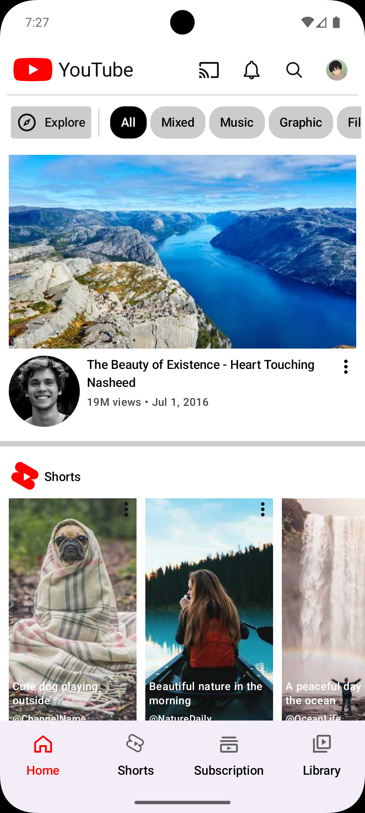
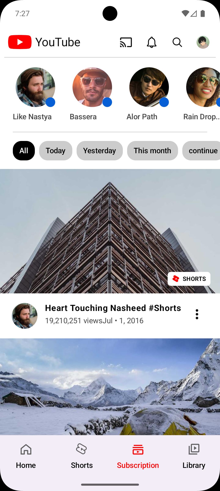
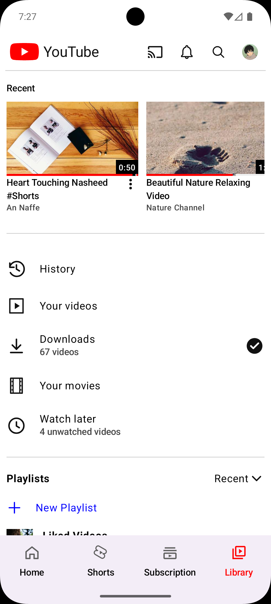
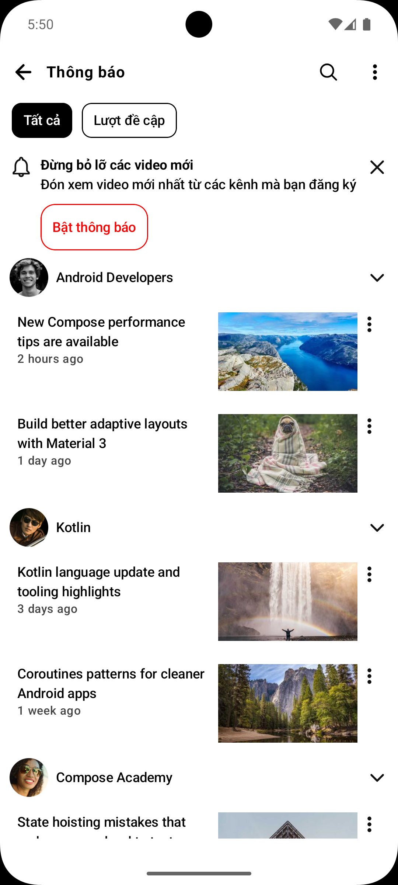
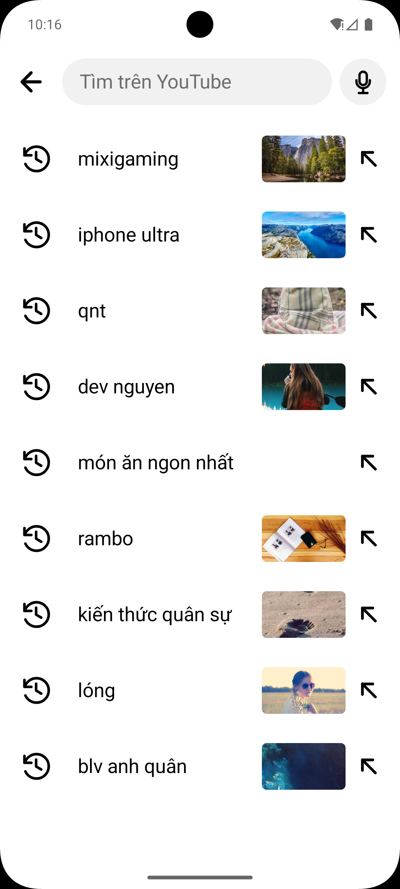

# YoutobeCompose

Android app clone giao diện YouTube bằng Kotlin, Jetpack Compose, Navigation Compose và Hilt. Project đang tập trung vào các màn chính: Home, Shorts, Subscription và Library.

## UI Preview

Ảnh chụp UI hiện nằm trong `docs/screenshots/`.

| Home | Shorts | Subscription |
| --- | --- | --- |
|  |  |  |

| Library | Notification | Search |
| --- | --- | --- |
|  |  |  |

## Tech Stack

- Kotlin
- Jetpack Compose
- Material 3
- Navigation Compose
- Hilt
- Coil
- Kotlin Serialization

## Current Screens

- Home feed with video cards, filters and Shorts section
- Shorts full-screen vertical pager with action rail and channel info
- Subscription feed with channel row, filter chips and video cards
- Library screen with recent videos, menu items and playlists
- Notification screen with filter tabs and notification list
- Search screen with input bar and history suggestions

## Run

```bash
./gradlew :app:assembleDebug
```

For quick Kotlin compile check:

```bash
./gradlew :app:compileDebugKotlin
```

## Project Notes

- UI follows `Route -> Screen -> Item` composable structure.
- ViewModels expose `StateFlow` for UI state and `SharedFlow` for one-shot effects.
- Mock data is currently loaded inside ViewModels while screens are being built.
- `.kotlin/sessions/` is a local Gradle/Kotlin artifact and should not be committed.
